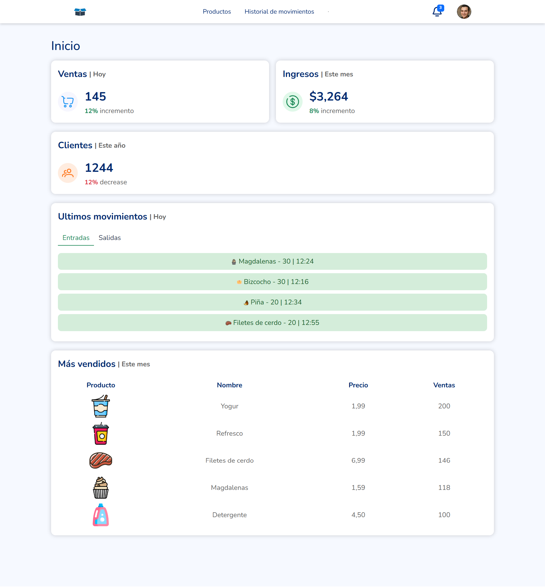

# 📝 Inventario App
Inventario web de un supermercado ficticio, el usuario puede consultar los distintos productos, así como su stock, precios y diferentes datos. Los usuarios logueados tienen acceso a todas las posibilidades de la web, como poder crear un producto y añadirlo al inventario, añadir o restar unidades de dicho producto, etc, mientras que si no estás logueado no podrás modificar nada ni tendrás acceso al historial de movimientos.  

## 🔎 Descripción general
Diseño responsive para resolución mobile(375px), tablet(768px) y desktop(1440px)

### 📷 Captura de pantalla

### 🔗 Links
- [Repositorio Git](https://github.com/braismarquez2025/Inventario_app)
- [URL del sitio en vivo](https://inventario.store/)

## 💡 Mi proceso

### 🔧 Llevado a cabo con
- Django
- Bootstrap

### 🚀 Desarrollo continuo
He englobado todos mis conocimientos de django actuales en este proyecto, añadiendo características como registrarse, loguearse, la creación de un perfil por usuario, entre otras.

Agradezco cualquier feedback con la finalidad de seguir mejorando 📈

### ✌️ Autor 
- 💼 GitHub - https://github.com/braismarquez2025
- ✉️ Gmail - braismarquez2003@gmail.com
- 👤 Usuario de Frontend - [@braismarquez2025](https://www.frontendmentor.io/profile/braismarquez2025)
- 🔗 LinkedIn - [Brais Márquez](https://www.linkedin.com/in/brais-m%C3%A1rquez-b133b7365/)